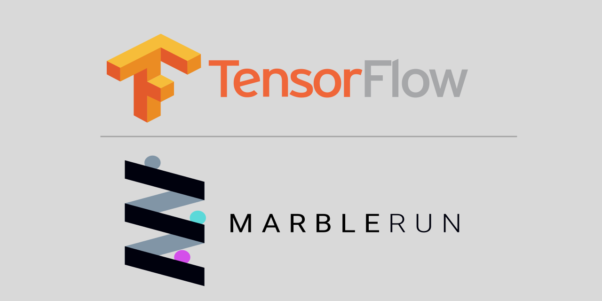

# Privacy Preserving Machine Learning Demo using Tensorflow

This demo is based on the [Graphene Tensorflow Demo](https://github.com/oscarlab/graphene), using Graphene to run a Tensorflow Model Server in an SGX enclave and MarbleRun to take care of attestation and secret provisioning.

**Warning**: This sample enables `loader.insecure__use_host_env` in [tensorflow_model_server.manifest.template](graphene-files/tensorflow_model_server.manifest.template). Don't use this on production until [secure forwarding of host environment variables](https://github.com/oscarlab/graphene/issues/2356) will be available.

## How it works


1.	The model owner encrypts the model and uploads the encrypted model to a cloud storage
2.	The administrator deploys MarbleRun with a manifest defining the topology and components of the confidential ML deployment
3.	The administrator deploys the confidential ML application.
4.	MarbleRun takes care of authentication and bootstrapping procedures.
5.	The model owner verifies the deployment via MarbleRun and uploads the encryption key securely to the TensorFlow Serving application via MarbleRun’s secret distribution.
6.	The application can decrypt the model inside the enclave via the provisioned key.
7.	Clients can verify the deployment via MarbleRun and connect securely to the inference service, knowing that their data is only accessible inside the enclave and their predictions are made by the integrity-protected TensorFlow Serving application.
## Install dependencies

To run the python scripts we need python3 and some extra libraries. Make sure pip is up to date and run:
```bash
pip3 install --upgrade pip
pip3 install -r ./client/requirements.txt
pip3 install grpcio~=1.34.0
```

To encrypt the model we need Gramine's `pf-crypt` tool. For installation instructions refer to the [Gramine GitHub](https://github.com/gramineproject/gramine/releases/tag/v1.0)

## Running the demo

We provide [a docker image](https://github.com/orgs/edgelesssys/packages/container/package/tensorflow-graphene-marble) to run TensorFlow Serving with Graphene and MarbleRun.
You can also [build it yourself](#Building-the-Docker-Image).

### On Kubernetes

This tutorial will show you how to run the demo on Kubernetes. 
A running cluster is required.

Make sure your cluster supports SGX and out-of-process attestation. You can follow [the guide by Microsoft](https://docs.microsoft.com/en-us/azure/confidential-computing/confidential-nodes-out-of-proc-attestation) to create a AKS cluster with all the needed resources.

If you built your own image you will have to change the image name in `kubernetes/templates/tf-server.yaml`.

1. Start the MarbleRun coordinator
    ```bash
    marblerun install
    ```

1. Wait for MarbleRun to set-up
    ```bash
    marblerun check
    ```

1. Port-forward the client API service to localhost
    ```bash
    kubectl -n marblerun port-forward svc/coordinator-client-api 4433:4433 --address localhost >/dev/null &
    export MARBLERUN=localhost:4433
    ```

1. Download and convert the model
    ```bash
    ./tools/download_model.sh
    models_abs_dir=`pwd -P`
    python3 ./tools/model_graph_to_saved_model.py --import_path ${models_abs_dir}/models/resnet50-v15-fp32/resnet50-v15-fp32.pb --export_dir ${models_abs_dir}/models/resnet50-v15-fp32 --model_version 1 --inputs input --outputs predict
    mkdir plain
    mv models/resnet50-v15-fp32/1/saved_model.pb plain/
    ```

1. Use Graphene's `pf-crypt` to generate a key and encrypt the model.
    ```bash
    gramine-sgx-pf-crypt gen-key --wrap-key model_key
    gramine-sgx-pf-crypt encrypt --input plain/saved_model.pb --output models/resnet50-v15-fp32/1/saved_model.pb --wrap-key model_key
    ```

1. Generate a user certificate and key.
    ```bash
    openssl req -x509 -newkey rsa:4096 -sha256 -nodes -keyout user_credentials.key -out user_credentials.crt
    ```

1. Insert the output of the following command as `Certificate` for user `tf-admin` in `manifest.json` (replacing `USER_CERT`)
    ```bash
    awk 'NF {sub(/\r/, ""); printf "%s\\n",$0;}' user_credentials.crt
    ```

1. Upload the manifest:
    ```bash
    marblerun manifest set manifest.json $MARBLERUN
    ```

1. Upload the model key to MarbleRun.
    ```bash
    sed -i "s|KEY_DATA|$(cat model_key | base64)|g" pfKey.json
    marblerun secret set pfKey.json $MARBLERUN --key user_credentials.key --cert user_credentials.crt
    ```

1. Create and add the tensorflow namespace to MarbleRun
    ```bash
    kubectl create namespace tensorflow
    marblerun namespace add tensorflow
    ```

1. Start the Tensorflow Model Server
    ```bash
    helm install -f ./kubernetes/values.yaml tensorflow-demo ./kubernetes -n tensorflow
    ```

1. Upload the model to Kubernetes
    ```bash
    kubectl cp ./models/resnet50-v15-fp32/1/saved_model.pb tensorflow/`kubectl -n tensorflow get pods --template '{{range .items}}{{.metadata.name}}{{"\n"}}{{end}}'`:/tensorflow-marblerun/models/resnet50-v15-fp32/1/saved_model.pb
    ```

1. Get MarbleRun's certificate
    ```bash
    marblerun certificate intermediate $MARBLERUN -o tensorflow.crt
    ```

1. Get TensorFlow's domain name

    Usually, one would set up DNS resolution for the cluster.
    To keep things simple, we will create a mapping of the TensorFlow Model Server IP to a domain name using `/etc/hosts`

    * First get the IP Adress:
        ```bash
        tf_ip_addr=`kubectl get svc -n tensorflow -o jsonpath='{.items[0].status.loadBalancer.ingress[0].ip}'`
        ```
    * Set the mapping in `/etc/hosts`:
        ```bash
        echo "${tf_ip_addr} grpc.tensorflow-serving.com" >> /etc/hosts
        ```

1. Submit a request using encrypted traffic over gRPC
    ```bash
    python3 ./client/resnet_client_grpc.py --url grpc.tensorflow-serving.com:8500 --crt ./tensorflow.crt --batch 1 --cnum 1 --loop 10
    ```

### Cleaning up

1. Remove tensorflow from the cluster
    ```bash
    helm uninstall tensorflow-demo -n tensorflow
    kubectl delete namespace tensorflow
    ```

1. Uninstall MarbleRun
    ```bash
    marblerun uninstall
    ```

### Standalone

You can run the demo with MarbleRun in standalone mode as follows:

1. Start MarbleRun
    ```bash
    erthost ${marblerun_dir}/build/coordinator-enclave.signed
    export MARBLERUN=localhost:4433
    ```

1. Download and convert the model
    ```bash
    ./tools/download_model.sh
    models_abs_dir=`pwd -P`
    python3 ./tools/model_graph_to_saved_model.py --import_path ${models_abs_dir}/models/resnet50-v15-fp32/resnet50-v15-fp32.pb --export_dir ${models_abs_dir}/models/resnet50-v15-fp32 --model_version 1 --inputs input --outputs predict
    mkdir plain
    mv models/resnet50-v15-fp32/1/saved_model.pb plain/
    ```

1. Use Graphene's `pf-crypt` to generate a key and encrypt the model.
    ```bash
    gramine-sgx-pf-crypt gen-key --wrap-key model_key
    gramine-sgx-pf-crypt encrypt --input plain/saved_model.pb --output models/resnet50-v15-fp32/1/saved_model.pb --wrap-key model_key
    ```

1. Generate a user certificate and key.
    ```bash
    openssl req -x509 -newkey rsa:4096 -sha256 -nodes -keyout user_credentials.key -out user_credentials.crt
    ```

1. Insert the output of the following command as `Certificate` for user `tf-admin` in `manifest.json`(replacing `USER_CERT`)
    ```bash
    awk 'NF {sub(/\r/, ""); printf "%s\\n",$0;}' user_credentials.crt
    ```

1. Upload the manifest:
    ```bash
    marblerun manifest set manifest.json $MARBLERUN
    ```

1. Upload the model key to MarbleRun.
    ```bash
    sed -i "s|KEY_DATA|$(cat model_key | base64)|g" pfKey.json
    marblerun secret set pfKey.json $MARBLERUN --key user_credentials.key --cert user_credentials.crt
    ```

1. Start the Tensorflow Model Server
    This will pull our docker image. If you wish to use your own, specify the name of your image instead.
    ```bash
    ./tools/run_tf_image.sh
    ```

1. Get MarbleRun's intermediate certificate to connect to the model server.
    ```bash
    marblerun certificate intermediate $MARBLERUN -o tensorflow.crt
    ```

1. Test the model server using the gRPC client
    ```bash
    python3 ./client/resnet_client_grpc.py --url localhost:8500 --crt tensorflow.crt --batch 1 --cnum 1 --loop 10
    ```

## Building the Docker Image

1. Generate a signing key
    ```bash
    openssl genrsa -3 -out enclave-key.pem 3072
    ```

1. Next we can build the Docker image:
    ```bash
    docker buildx build --secret id=signingkey,src=<path to private.pem> --tag ghcr.io/edgelesssys/tensorflow-graphene-marble:latest .
    ```