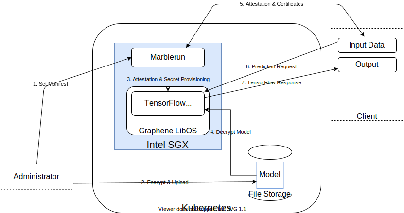

# Privacy Preserving Machine Learning Demo using Tensorflow

This demo is based on the [Graphene Tensorflow Demo](https://github.com/oscarlab/graphene), using Graphene to run a Tensorflow Model Server in an SGX enclave and Marblerun to take care of attestation and secret provisioning.

**Warning**: This sample enables `loader.insecure__use_host_env` in [tensorflow_model_server.manifest.template](graphene-files/tensorflow_model_server.manifest.template). Don't use this on production until [secure forwarding of host environment variables](https://github.com/oscarlab/graphene/issues/2356) will be available.

## How it works


1. The TensorFlow admin uploads the Marblerun manifest to the Marblerun coordinator, defining parameters under which programs are allowed to run.
1. The admin encrypts a pre-trained model and uploads it to Kubernetes file storage.
1. The coordinator attests the TensorFlow Serving app and provisions it with cryptographic keys in accordance with the manifest.
1. The app decrypts the model. (It obtained the corresponding cryptographic key in the previous step.)
1. The client attests the coordinator. It obtains a trusted TLS certificate for connections to the app.
1. The client requests a prediction over the attested TLS connection.
1. The app sends its response.

## Install dependencies

To run the python scripts we need python3 and some extra libraries. Make sure pip is up to date and run:
```bash
pip3 install --upgrade pip
pip3 install -r ./client/requirements.txt
pip3 install grpcio~=1.34.0
```

## Running the demo

We provide [a docker image](https://github.com/orgs/edgelesssys/packages/container/package/tensorflow-graphene-marble) to run TensorFlow Serving with Graphene and Marblerun.
You can also [build it yourself](#Building-the-Docker-Image).

<<<<<<< HEAD
<<<<<<< HEAD
=======
### Standalone
=======
### On Kubernetes
>>>>>>> 5595f57... update docker build steps in readme

This tutorial will show you how to run the demo on Kubernetes. 
A running cluster is required.

Make sure your cluster supports SGX and out-of-process attestation. You can follow [the guide by Microsoft](https://docs.microsoft.com/en-us/azure/confidential-computing/confidential-nodes-out-of-proc-attestation) to create a AKS cluster with all the needed resources.

If you built your own image you will have to change the image name in `kubernetes/templates/tf-server.yaml`.

1. Start the Marblerun coordinator
    ```bash
    marblerun install --domain="grpc.tf-serving.service.com\,localhost"
    ```

1. Wait for Marblerun to set-up
    ```bash
    marblerun check
    ```

1. Port-forward the client API service to localhost
    ```bash
    kubectl -n marblerun port-forward svc/coordinator-client-api 4433:4433 --address localhost >/dev/null &
    export MARBLERUN=localhost:4433
    ```

1. Download and convert the model
    ```bash
    ./tools/download_model.sh
    models_abs_dir=`pwd -P`
    python3 ./tools/model_graph_to_saved_model.py --import_path ${models_abs_dir}/models/resnet50-v15-fp32/resnet50-v15-fp32.pb --export_dir ${models_abs_dir}/models/resnet50-v15-fp32 --model_version 1 --inputs input --outputs predict
    mkdir plain
    mv models/resnet50-v15-fp32/1/saved_model.pb plain/
    ```

1. Use Graphene's `pf_crypt` to generate a key and encrypt the model.
    ```bash
    pf_crypt gen-key --wrap-key model_key
    pf_crypt encrypt --input plain/saved_model.pb --output models/resnet50-v15-fp32/1/saved_model.pb --wrap-key model_key
    ```

1. Generate a user certificate and key.
    ```bash
    openssl req -x509 -newkey rsa:4096 -sha256 -nodes -keyout user_credentials.key -out user_credentials.crt
    ```

1. Insert the output of the following command as `Certificate` for user `tf-admin` in `tf-server-manifest.json`
    ```bash
    awk 'NF {sub(/\r/, ""); printf "%s\\n",$0;}' user_credentials.crt
    ```

1. Upload the manifest:
    ```bash
    marblerun manifest set tf-server-manifest.json $MARBLERUN
    ```

1. Upload the model key to Marblerun.
    ```bash
    sed -i "s|KEY_DATA|$(cat model_key | base64)|g" pf_key.json
    marblerun secret set pf_key.json $MARBLERUN --key user_credentials.key --cert user_credentials.crt
    ```

1. Create and add the tensorflow namespace to Marblerun
    ```bash
    kubectl create namespace tensorflow
    marblerun namespace add tensorflow
    ```

1. Start the Tensorflow Model Server
    ```bash
    helm install -f ./kubernetes/values.yaml tensorflow-demo ./kubernetes -n tensorflow
    ```

1. Upload the model to Kubernetes
    ```bash
    kubectl cp ./models/resnet50-v15-fp32/1/saved_model.pb tensorflow/tf-server-xxxxxxxxx-xxxxx:/graphene/Examples/tensorflow-marblerun/models/resnet50-v15-fp32/1/saved_model.pb
    ```

1. Get Marblerun's certificate
    ```bash
    marblerun certificate intermediate $MARBLERUN -o tensorflow.crt
    ```

<<<<<<< HEAD
>>>>>>> 4dc8791... wip update to use secrets endpoint
### On Kubernetes
=======
1. Create mapping of the Tensorflow Model Server IP to its domain name
    * First get the IP Adress:
        ```bash
        tf_ip_addr=`kubectl get svc -n tensorflow -o jsonpath='{.items[0].status.loadBalancer.ingress[0].ip}'`
        ```
    * Set the mapping in `/etc/hosts`:
        ```bash
        echo "${tf_ip_addr} grpc.tf-serving.service.com" >> /etc/hosts
        ```
>>>>>>> 5595f57... update docker build steps in readme

1. Submit a request using encrypted traffic over gRPC
    ```bash
    python3 ./client/resnet_client_grpc.py --url grpc.tf-serving.service.com:8500 --crt ./tensorflow.crt --batch 1 --cnum 1 --loop 10
    ```

### Cleaning up

1. Remove tensorflow from the cluster
    ```bash
    helm uninstall tensorflow-demo -n tensorflow
    kubectl delete namespace tensorflow
    ```

1. Uninstall Marblerun
    ```bash
    marblerun uninstall
    ```

### Standalone

You can run the demo with Marblerun in standalone mode as follows:

1. Create a mapping of machine B's IP adress (the machine you plan to run the docker image on) to the Tensorflow Serving domain name (127.0.0.1 if you are running on just one machine)
    ```bash
    machineB_ip_addr=XX.XX.XX.XX
    echo "${machineB_ip_addr} grpc.tf-serving.service.com" >> /etc/hosts
    ```

1. Start Marblerun
    ```bash
    EDG_COORDINATOR_DNS_NAMES=grpc.tf-serving.service.com erthost ${marblerun_dir}/build/coordinator-enclave.signed
    export MARBLERUN=grpc.tf-serving.service.com:4433
    ```

1. Download and convert the model
    ```bash
    ./tools/download_model.sh
    models_abs_dir=`pwd -P`
    python3 ./tools/model_graph_to_saved_model.py --import_path ${models_abs_dir}/models/resnet50-v15-fp32/resnet50-v15-fp32.pb --export_dir ${models_abs_dir}/models/resnet50-v15-fp32 --model_version 1 --inputs input --outputs predict
    mkdir plain
    mv models/resnet50-v15-fp32/1/saved_model.pb plain/
    ```

1. Use Graphene's `pf_crypt` to generate a key and encrypt the model.
    ```bash
    pf_crypt gen-key --wrap-key model_key
    pf_crypt encrypt --input plain/saved_model.pb --output models/resnet50-v15-fp32/1/saved_model.pb --wrap-key model_key
    ```

1. Generate a user certificate and key.
    ```bash
<<<<<<< HEAD
<<<<<<< HEAD
    openssl req -x509 -newkey rsa:4096 -sha256 -nodes -keyout user_credentials.key -out user_credentials.crt
=======
    openssl req -x509 -newkey rsa:4096 -sha256 -days 3650 -nodes -keyout user_credentials.key -out user_credentials.crt
>>>>>>> 4dc8791... wip update to use secrets endpoint
=======
    openssl req -x509 -newkey rsa:4096 -sha256 -nodes -keyout user_credentials.key -out user_credentials.crt
>>>>>>> 5595f57... update docker build steps in readme
    ```

1. Insert the output of the following command as `Certificate` for user `tf-admin` in `tf-server-manifest.json`
    ```bash
    awk 'NF {sub(/\r/, ""); printf "%s\\n",$0;}' user_credentials.crt
    ```

1. Upload the manifest:
    ```bash
    marblerun manifest set tf-server-manifest.json $MARBLERUN
    ```

1. Upload the model key to Marblerun.
    ```bash
    sed -i "s|KEY_DATA|$(cat model_key | base64)|g" pf_key.json
    marblerun secret set pf_key.json $MARBLERUN --key user_credentials.key --cert user_credentials.crt
    ```

1. Start the Tensorflow Model Server
    This will pull our docker image. If you wish to use your own, specify the name of your image instead.
    ```bash
    ./tools/run_tf_image.sh ghcr.io/edgelesssys/tensorflow-graphene-marble:latest
    ```

1. Get Marblerun's intermediate certificate to connect to the model server.
    ```bash
    marblerun certificate intermediate $MARBLERUN -o tensorflow.crt
    ```

1. Test the model server using the gRPC client
    ```bash
    python3 ./client/resnet_client_grpc.py --url grpc.tf-serving.service.com:8500 --crt tensorflow.crt --batch 1 --cnum 1 --loop 10
    ```

### Standalone

You can run the demo with Marblerun in standalone mode as follows:

1. Create a mapping of machine B's IP adress (the machine you plan to run the docker image on) to the Tensorflow Serving domain name (127.0.0.1 if you are running on just one machine)
    ```bash
    machineB_ip_addr=XX.XX.XX.XX
    echo "${machineB_ip_addr} grpc.tf-serving.service.com" >> /etc/hosts
    ```

1. Start Marblerun
    ```bash
    EDG_COORDINATOR_DNS_NAMES=grpc.tf-serving.service.com erthost ${marblerun_dir}/build/coordinator-enclave.signed
    export MARBLERUN=grpc.tf-serving.service.com:4433
    ```

1. Download and convert the model
    ```bash
    ./tools/download_model.sh
    models_abs_dir=`pwd -P`
    python3 ./tools/model_graph_to_saved_model.py --import_path ${models_abs_dir}/models/resnet50-v15-fp32/resnet50-v15-fp32.pb --export_dir ${models_abs_dir}/models/resnet50-v15-fp32 --model_version 1 --inputs input --outputs predict
    mkdir plain
    mv models/resnet50-v15-fp32/1/saved_model.pb plain/
    ```

1. Use Graphene's `pf_crypt` to generate a key and encrypt the model.
    ```bash
    pf_crypt gen-key --wrap-key model_key
    pf_crypt encrypt --input plain/saved_model.pb --output models/resnet50-v15-fp32/1/saved_model.pb --wrap-key model_key
    ```

1. Generate a user certificate and key.
    ```bash
    openssl req -x509 -newkey rsa:4096 -sha256 -nodes -keyout user_credentials.key -out user_credentials.crt
    ```

1. Insert the output of the following command as `Certificate` for user `tf-admin` in `tf-server-manifest.json`
    ```bash
    awk 'NF {sub(/\r/, ""); printf "%s\\n",$0;}' user_credentials.crt
    ```

1. Upload the manifest:
    ```bash
    marblerun manifest set tf-server-manifest.json $MARBLERUN
    ```

1. Upload the model key to Marblerun.
    ```bash
    sed -i "s|KEY_DATA|$(cat model_key | base64)|g" pf_key.json
    marblerun secret set pf_key.json $MARBLERUN --key user_credentials.key --cert user_credentials.crt
    ```

1. Start the Tensorflow Model Server
    This will pull our docker image. If you wish to use your own, specify the name of your image instead.
    ```bash
    ./tools/run_tf_image.sh ghcr.io/edgelesssys/tensorflow-graphene-marble:latest
    ```

1. Get Marblerun's intermediate certificate to connect to the model server.
    ```bash
    marblerun certificate intermediate $MARBLERUN -o tensorflow.crt
    ```

1. Test the model server using the gRPC client
    ```bash
    python3 ./client/resnet_client_grpc.py --url grpc.tf-serving.service.com:8500 --crt tensorflow.crt --batch 1 --cnum 1 --loop 10
    ```

## Building the Docker Image

    ```bash
    docker buildx build --secret id=signingkey,src=<path to enclave-key.pem> --tag ghcr.io/edgelesssys/tensorflow-graphene-marble:latest /graphene
    ```
